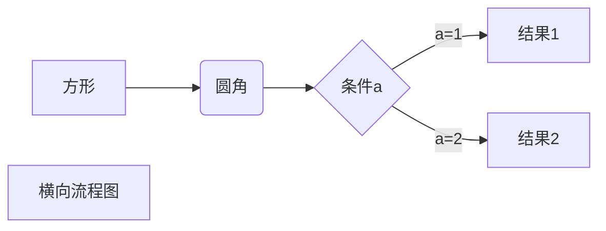
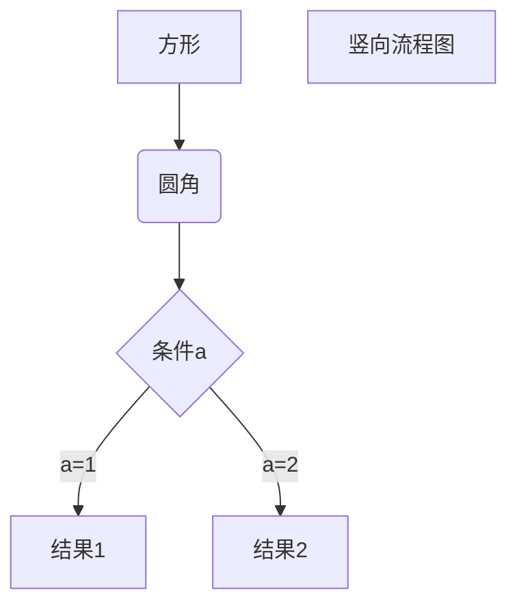

#标题
#一级标题
##二级标题
###三级标题

#段落
RUNOOB.COM  
GOOGLE.COM  

#字体
*斜体*
**粗体**
***粗斜体***

#无序列表
* 第一项
+ 第二项
- 第三项

1. 有序第一项
2. 有序第二项

1. 第一项：
    * 第一项嵌套的第一个元素
      * 再来
      * 在零零
    * 第一项嵌套的第二个元素


#引用
> 区块引用
>> 第二层
>>> 第三层
>>>
> 引用结束

#代码
```javascript
function add(a,b){
  return a+b;
} 
```
```python
def add(a,b):
  return a+b
```

#链接
> [链接名称](链接地址)
> 或者
> <链接地址>

这是一个链接 [菜鸟教程](https://www.runoob.com)
##高级链接
这个链接用 1 作为网址变量 [Google][1]
这个链接用 runoob 作为网址变量 [Runoob][runoob]
然后在文档的结尾为变量赋值（网址）

  [1]: http://www.google.com/
  [runoob]: http://www.runoob.com/

#图片
> 
> 


#表格

|  表头   | 表头  |
|  -  | ---  |
| 单元格单元格单元格</br>单元格单元格  | 单元格 |
| 单元格  | 单元格 |

##对齐方式
| 左对齐 | 右对齐 | 居中对齐 |
| :-----| ----: | :----: |
| 单元格 | 单元格 | 单元格 |
| 单元格 | 单元格 | 单元格 |

#公式
$$x^2+y_a^2$$
$$
\begin{Bmatrix}
   a & b \\
   c & d
\end{Bmatrix}
$$
$$
\begin{CD}
   A @>a>> B \\
@VbVV @AAcA \\
   C @= D
\end{CD}
$$



```flow
st=>start: 开始框
op=>operation: 处理框
cond=>condition: 判断框(是或否?)
sub1=>subroutine: 子流程
io=>inputoutput: 输入输出框
e=>end: 结束框
st->op->cond
cond(yes)->io->e
cond(no)->sub1(right)->op
```
```sequence
对象A->对象B: 对象B你好吗?（请求）
Note right of 对象B: 对象B的描述
Note left of 对象A: 对象A的描述(提示)
对象B-->对象A: 我很好(响应)
对象A->对象B: 你真的好吗？
```